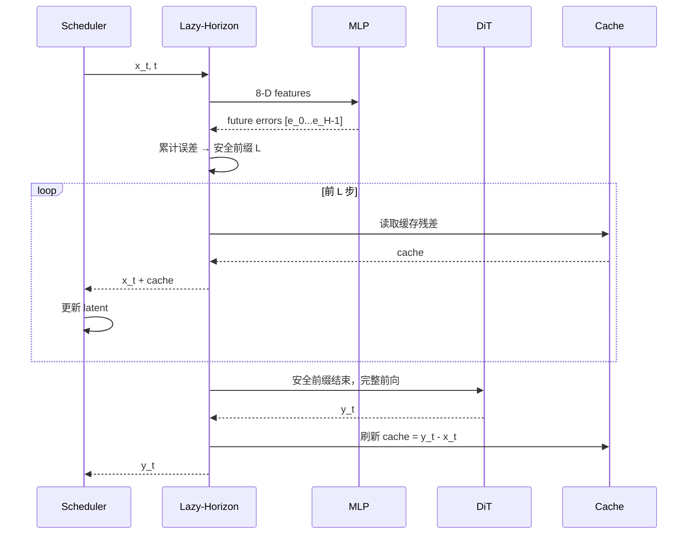

```mermaid
sequenceDiagram
    participant S as Scheduler
    participant L as Lazy-Horizon
    participant M as MLP
    participant D as DiT
    participant C as Cache

    S->>L: x_t, t
    L->>M: 8-D features
    M-->>L: future errors [e_0...e_H-1]
    L->>L: 累计误差 → 安全前缀 L

    loop 前 L 步
        L->>C: 读取缓存残差
        C-->>L: cache
        L-->>S: x_t + cache
        S->>S: 更新 latent
    end

    L->>D: 安全前缀结束，完整前向
    D-->>L: y_t
    L->>C: 刷新 cache = y_t - x_t
    L-->>S: y_t

```